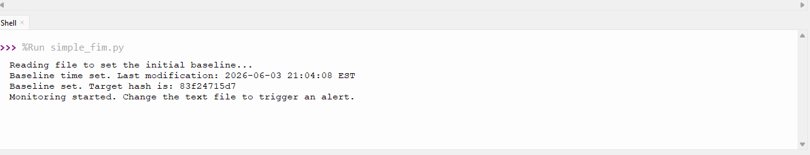
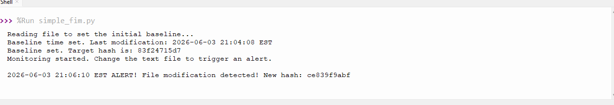
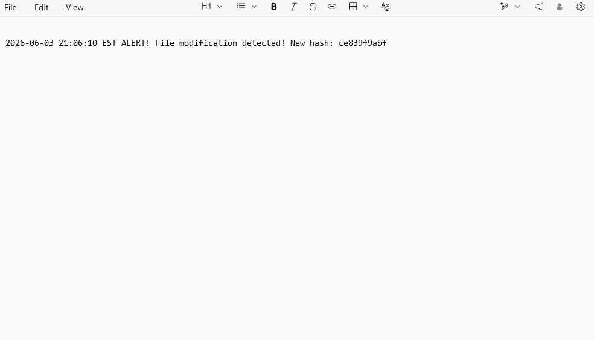

# File-Integrity-Monitor

## Project Overview
This project is a beginner, host-based File Integrity Monitor (FIM) written in Python. It establishes a cryptographic baseline of a target file using the SHA-256 algorithm and continuously monitors it for unauthorized modifications or deletions. When a change is detected, the script generates a real-time alert with an explicit timestamp and writes the event to a persistent security log for incident response analysis.

## Concepts Applied
* **Data Integrity & Hashing:** Utilizes `hashlib.sha256` to create immutable baselines of critical files, ensuring data has not been tampered with.
* **Persistent Logging & Audit Trails:** Implements file append operations (`"a"` mode) to generate chronological security logs (`security_log.txt`) mirroring real-world SIEM data ingestion.
* **Incident Timeline Reconstruction:** Enforces strict timezone formatting to aid analysts in rapid incident triage.

## Architecture & Operational Flow
1. **Initialization:** The script performs an initial read (`"rb"` mode) of the target file to compute the baseline SHA-256 hash.
2. **Monitoring Loop:** Enters a continuous loop, re-hashing the file every 2 seconds.
3. **Triage & Alerting:** Compares the current hash against the baseline. If they do not match, an alert is triggered.
4. **Log Persistence:** The alert is printed to the console and appended to a localized log file.

### Project Code
Below is the complete script:

```python
import os
import hashlib
import time
from datetime import datetime, timedelta, timezone
  
#Setting up file paths
target_file = "./test.txt"
log_file = "./security_log.txt"
  
#Define EST timezone
EST = timezone(timedelta(hours =-4))
  
print("Reading file to set the initial baseline...")
  
#Calcualte the original hash of the file(The Baseline)
file_contents = open(target_file, "rb").read()
baseline_hash = hashlib.sha256(file_contents).hexdigest()
  
#Get current time in EST
baseline_time = datetime.now(EST).strftime("%Y-%m-%d %H:%M:%S EST")
  
print(f"Baseline time set. Last modification: {baseline_time}")
print(f"Baseline set. Target hash is: {baseline_hash[:10]}")
print("Monitoring started. Change the text file to trigger an alert.\n")
  
#Continuously check the file
while True:
  time.sleep(2) #Wait two seconds before checking again
      
  #Read file to see its current state
  current_contents = open(target_file, "rb").read()
  current_hash = hashlib.sha256(current_contents).hexdigest()
      
  #Compare the current hash to baseline
  if current_hash != baseline_hash:
          
    #Get exact time of modification
    mod_time = datetime.now(EST). strftime("%Y-%m-%d %H:%M:%S EST")
    log_message = (f"{mod_time} ALERT! File modification detected! New hash: {current_hash[:10]}\n")
          
    #Print message
    print(log_message.strip())
          
    #Append the message to security log document
    with open(log_file, "a") as f:
      f.write(log_message)
          
    #Update the baseline with new version
    baseline_hash = current_hash
```

## Proof of Concept (Logs & Telemetry)




    


